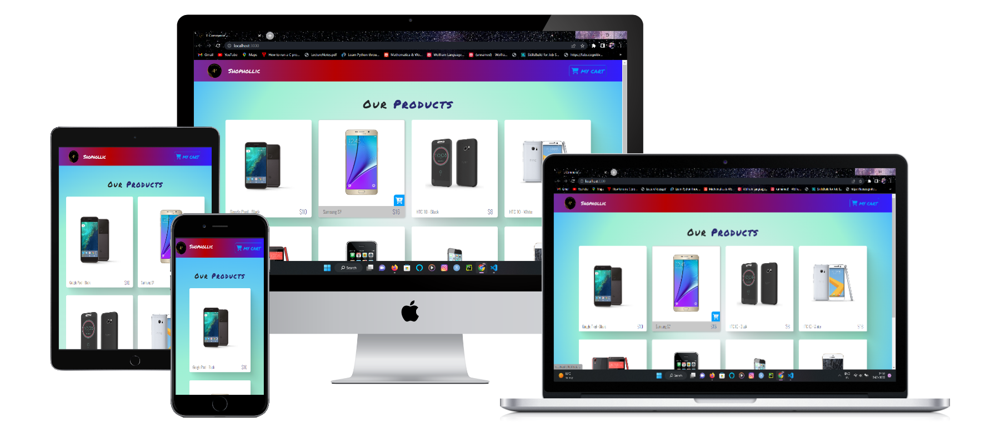
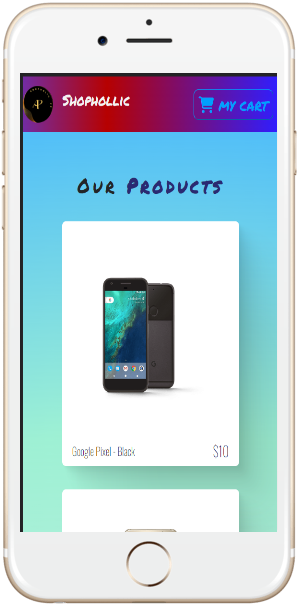
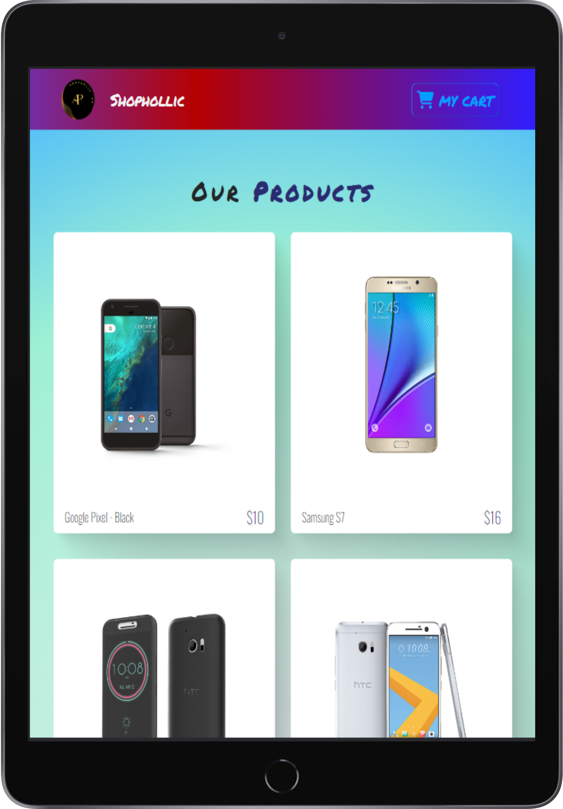

  
  

   
  <h1><b>Shopholic</b>  </h1>
  
 

  <h1>App Mock</h1>
  
  <h1>Mobile view & tablate view</h1>
  
  

 
 
  
<!-- TABLE OF CONTENTS -->

# 📗 Table of Contents

- [📖 About the Project](#about-project)
  - [🛠 Built With](#built-with)
    - [Tech Stack](#tech-stack)
    - [Key Features](#key-features)
  - [🚀 Live Demo](#live-demo)
- [💻 Getting Started](#getting-started)
  - [Setup](#setup)
  - [Prerequisites](#prerequisites)
  - [Install](#install)
  - [Usage](#usage)
  - [Run tests](#run-tests)
  - [Deployment](#triangular_flag_on_post-deployment)
- [👥 Authors](#authors)
- [🔭 Future Features](#future-features)
- [🤝 Contributing](#contributing)
- [⭐️ Show your support](#support)
- [🙏 Acknowledgements](#acknowledgements)
- [❓ FAQ ](#faq)
- [📝 License](#license)

<!-- PROJECT DESCRIPTION -->

# 📖 Shopholic 

> This Project is for online shoping of the mobile product  

**Shopholic** is a React-oriented project,
This is a e-commerce product base website with advance funtionality like "Add to cart, modal, total sub total payment etc" this is build with the help of free code camp yt channel while learning React 

 

## 🛠 Built With 

### Tech Stack 

> In this project I used many skills, tech and libraries

  
Documentation

  <ul>
    <li><a href="https://html.com">HTML</a></li>
  </ul>

  
Styling

  <ul>
    <li><a href="https://www.w3.org">CSS</a></li>
  </ul>

Dynamics And Logics

  <ul>
    <li><a href="https://www.javascript.com">JavaScript</a></li>
  </ul>

Frame Work

  <ul>
    <li><a href="https://reactjs.org/">React</a></li>
    <li><a href="https://reactjs.org/">Context Api</a></li>
  </ul>

 

<!-- Features -->

### Key Features 

> Following features you should observe

- **You can add your product in cart**
- **You can remove your product from cart**
- **your total amount of  product in cart**
- **modal opening on taping cart button**
- **Details page on tapping on respective product image**

(<a href="#readme-top">back to top</a>)

<!-- LIVE DEMO -->

## 🚀 Live Demo 

> This link will guide you to my project

- [Live Demo Link](https://react-e-commerce-store-react.netlify.app/)

(<a href="#readme-top">back to top</a>)

<!-- GETTING STARTED -->

## 💻 Getting Started 

>For having local file and project you can fork this repo 

>And for making changes you you should follow prerequisites

### Prerequisites
To edit this project you need:
 - Node.js installed
 - A Terminal 
 - A web browser
 - An IDE

 - suggested IDE
   - visual studio code
   - atom 
   - visual code 

### Setup

Clone this repository to your desired folder:

 - And run `npm i` in root dir <small>to install node modules</small>
 - Then run `npm start`
 - All this makes our project open  in the browser

### Usage

 Execute the following thing:
 
 - for selling and buying the products 
 - check details of the product

### Run tests

- To run all test cases you need to run `npm test` in the root dir 
- Linters for files run in the root dir
  - `npx eslint "**/*.{js,jsx}` for JS or jsx linting
  - `npx stylelint "**/*.{css,scss}"`for CSS or SCSS linting
  - `--fix` flag for instant fixable fix
 

### Deployment

You can deploy this project using:
- Fork our Repo and clone it or download `zip` and extract it
- Edit some changes
- Run `npm run build` to make our project production ready
- deploy it using [GitHub](www.github.com) pages (gh-pages run `npm i -D gh-pages` )
- also, you can use netlify to deploy it
 

(<a href="#readme-top">back to top</a>)

<!-- AUTHORS -->

## 👥 Authors 

👤 **Adarsh Pathak**

- GitHub: [@PowerLevel9000](https://github.com/githubhandle)
- Twitter: [@PowerLevel9002](https://twitter.com/PowerLevel9002?t=AIuSN7mTxk5a_MWpLolEjA&s=09)
- LinkedIn: [@Adarsh Pathak](https://www.linkedin.com/in/adarsh-pathak-56a831256/)

<!-- FUTURE FEATURES -->

## 🔭 Future Features 

> Describe 1 - 3 features you will add to the project.

- [ ] **Payment Gateway**
- [ ] **improve functionality**
- [ ] **improve styling**
- [ ] **Some more pages**

(<a href="#readme-top">back to top</a>)

<!-- CONTRIBUTING -->

## 🤝 Contributing 

Contributions, issues, and feature requests are welcome!

Feel free to check the [issues page](https://github.com/PowerLevel9000/e-commerce/issues).

(<a href="#readme-top">back to top</a>)

<!-- SUPPORT -->

## ⭐️ Show your support 

If you like my Project give it a Star ✨🌟 

(<a href="#readme-top">back to top</a>)

## 🙇 Acknowledgements 

<a href="https://github.com/john-smilga">@john-smilga</a> for great experince in react tutorial

## ❓ FAQ 

> ask questions to be here 

- **Question_1** How to add a product to cart 

  - Answer_1 there is few option to do that:
      - with cart button appearing on hovering the product
      - from details page after hitting the product image 

- **Question_2** How to remove a product from cart  

  - Answer_2 there is few option to do that:
      - with remove button with respective product in cart page 
      - be decrementing the quantity to 0 in cart page 
- **Question_3** How to clear cart  

  - Answer_2 just tap on clear cart on cart page 

  conform on modal for clear cart

(<a href="#readme-top">back to top</a>)

<!-- LICENSE -->

## 📝 License 

This project is [MIT](https://github.com/PowerLevel9000/e-commerce/blob/dev/LICENSE) licensed.

(<a href="#readme-top">back to top</a>)

